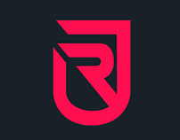
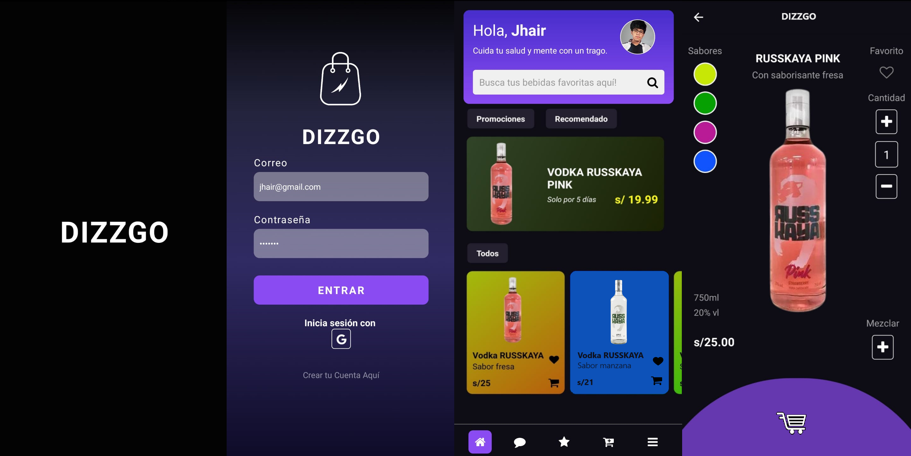

<div align="center">
    <a href="https://github.com/JheysonJhair/FTdizzgo.git">
      
    </a>
    <h1>APP MOVIL - Dizzgo</h1>
    <p align="center">
        Frontend Developer Jhair
    </p>
</div>

## Preview



## Tecnologías

Este proyecto utiliza las siguientes tecnologías:

- React Native
- Javascript
- CSS
- BACKEND:

```bash
git https://github.com/Edsghot/jheytedBk
```

## Cómo levantar el proyecto

1. Clona el repositorio.

```bash
git clone https://github.com/JheysonJhair/FTdizzgo.git
```

```bash
cd FTdizzgo
```

2. Instala las dependencias con `npm install`.

```bash
npm install
```

3. Ejecuta el comando `npm start` para iniciar el servidor de desarrollo.

```bash
npm start
```

4. Seleccione la opción de preferencia y ejecuta.

¡Listo! Ahora puedes comenzar a trabajar en la aplicación sin problemas.